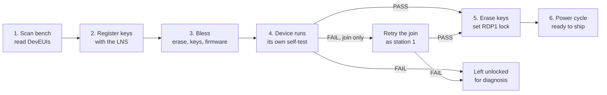

# Blessing Rig — Process Overview

| Property | Value |
|----------|-------|
| **Product** | FSO (Field Sensing & Occupancy) |
| **Audience** | Operators, production, anyone new to the rig |
| **Status** | In use |
| **Last updated** | 2026-09-24 |

> This is the short version. For parameters, error codes, script internals and service
> integration, see *Blessing Rig — Scaled Device Provisioning*.

---

## What blessing is

Blessing is the factory provisioning step. It turns a bare board into a device the LoRaWAN
network accepts, then proves the hardware works.

The rig handles **up to 6 devices at once**. Each device gets its own ST-LINK probe and its
own process, so one device cannot stall or fail another.

Measured: **4 devices blessed in 34 seconds**, including four network joins.

---

## The process



*Render with the Mermaid macro, or a Code Block macro set to `mermaid`.*

| Phase | What happens | Who does it |
|-------|--------------|-------------|
| 1. Scan | Read each device's DevEUI. Nothing is written. | `scan_device.ps1` |
| 2. Register | Mint keys and register them against the DevEUI. | Blessing service |
| 3. Bless | Erase the board, write the keys, flash the firmware, reboot. | `bless_rig.ps1` |
| 4. Self-test | The device checks its own hardware, then joins the network. | Device firmware |
| 5. Secure | On the devices that passed only: erase the keys, lock the debugger. | `bless_rig.ps1 -Secure` |
| 6. Power cycle | The lock takes effect. | Operator |
| Retry, optional | A device that failed only its join is rebooted and tested again. It is not reflashed. | `bless_rig.ps1 -RetryAsStation1 -Secure` |
| Release, optional | A locked device is unlocked and wiped blank. | `release_device.ps1` |

**Why phases 1 and 2 are separate.** The DevEUI comes from the chip. It cannot be chosen.
So the board has to be identified before its keys can be minted and registered. Keys must
reach the network **before** the device boots, because it tries to join within seconds of
being flashed.

---

## What the operator runs

Set the execution policy once per terminal:

```powershell
Set-ExecutionPolicy -Scope Process -ExecutionPolicy Bypass
```

**Check the bench.** Safe at any time. Reads only.

```powershell
.\scan_device.ps1
```

**Dry run.** Always do this for an unfamiliar command. Every real run erases its devices.

```powershell
.\bless_rig.ps1 -DeviceList .\rig_devices.csv -Stations 1,2,3 -DryRun
```

**Production run.** Blesses, then secures whatever passed.

```powershell
.\bless_rig.ps1 -DeviceList .\rig_devices.csv -Stations 1,2,3 -Region US915 `
                -Keys "1=<key>:<eui>,2=<key>:<eui>,3=<key>:<eui>" `
                -ReadVerdict -Secure
```

Then **power cycle the rig.**

**Retry a join failure.** Use this only when the hardware passed and the join failed
(`0xD5000100`). Run one station at a time, and stay at the bench.

```powershell
.\bless_rig.ps1 -DeviceList .\rig_devices.csv -Stations 3 -RetryAsStation1 -Secure
```

**Release a locked device.** This mass erases the device. Name one station only.

```powershell
.\release_device.ps1 -Stations 2
```

---

## Pass and fail

The device reports its own result. Four things are checked:

| Check | Proves |
|-------|--------|
| PIR | The motion sensor triggers. |
| SPI flash | The external flash answers. |
| KTD I2C | The LED driver answers on I2C. This does **not** prove the LEDs light. |
| Network join | The device joined the LoRaWAN network. |

A device passes only when **every** check passes. There is no partial pass.

| Result | What happens to the device |
|--------|----------------------------|
| **PASS** | Keys erased, debugger locked, ready to ship. |
| **FAIL, hardware** | Left fully readable. The result names the failing part. |
| **FAIL, network join** | Left fully readable. Check the gateway, then retry the join. See *Retrying a join failure*. |
| **No result** | Left fully readable. The device did not report in time. |

**A failed device is never locked and never erased.** It stays diagnosable, and it can be
blessed again.

If the hardware fails, the join is never attempted. Never report a join failure alongside
a hardware fault.

---

## What "secured" means

Two things happen to a device that passed:

1. **The keys are erased.** The AppKey, join identifier and region leave the board.
2. **The debugger is locked out.** Read-out protection level 1 is set. Flash can no longer
   be read over the debug port.

The lock applies on the next power-on reset. Until then the device still answers the
debugger.

**The lock is reversible.** Run `release_device.ps1`, or use STM32CubeProgrammer. Unlocking
**erases the whole board**, which is the point. A locked board is a reflash, not a
write-off. It then needs a full re-bless.

---

## Retrying a join failure

A device that passed its hardware and failed only its join does not need a full re-bless.
Its firmware and keys are correct. The retry changes one thing: it moves the device to
station 1's op-code, `0x11`.

`0x11` gives the device join channel 0 and no join stagger. That is the best join chance
the rig offers.

What the retry does:

1. Reads the key page twice and checks that the two reads agree.
2. Checks that the board is the blessed board this station expects.
3. Rewrites the key page with op-code `0x11`. The AppKey, JoinEUI and region stay the same.
4. Reboots the device. The device runs its full self-test again.
5. Reads the new result. With `-Secure`, a PASS is secured in the same run.

What the retry does **not** do:

- It does not mass erase the board.
- It does not write the firmware.
- It does not touch the LoRaWAN memory. The network still accepts the device's next join.

Rules for the operator:

- **One station per run.** Two devices on `0x11` would join on the same channel at the
  same time.
- **Stay at the bench.** The self-test waits up to 7.5 seconds for motion on the PIR. An
  unattended retry reports a PIR fault on a good board.
- **Do not pass `-Keys`, `-Region` or `-FirmwarePath`.** The retry refuses them. It keeps
  the keys that are already on the board.
- **Do not retry a hardware fault.** A reboot does not fix a bad part.

**One new risk.** If the key page write fails after the erase, the board has **no keys**.
The station then reports exit code 3. That board needs a full blessing.

---

## Releasing a locked device

`release_device.ps1` removes the RDP1 lock from one device. **It mass erases the device.**
The board comes back blank: no firmware, no keys. It needs a full blessing after that.

- Name **one** station. The script refuses a list.
- If the device is already unlocked, the script erases nothing.
- The script reads the lock level and the flash back after the release. It reports
  `released: true` only when both show that the release worked.

Power cycle the device, then bless it again.

---

## Results at a glance

| Exit code | Meaning | Action |
|-----------|---------|--------|
| **0** | Every device passed and was locked. | Power cycle. Ship them. |
| **1** | Setup or configuration error. **Nothing was flashed.** | Fix the command or the device list. Re-run. |
| **2** | At least one device did not pass. | Read the per-device result. The failures are diagnosable. |
| **3** | Every device passed, but a lock failed. | Read the per-device result. Do not ship an unlocked board. |

A dry run also exits 0. Check whether the run was a dry run before reading a 0 as success.

---

## When something fails

| Symptom | First thing to check |
|---------|----------------------|
| A station reports no probe | The ST-LINK is not attached, or its serial is wrong in `rig_devices.csv`. |
| Connect or verify errors on one station | Lower the SWD clock. Pass `-Freq 8000`, then `-Freq 4000`. |
| Every device fails its network join | The gateway is unreachable, or the keys were never registered. Check the gateway first. |
| One device fails only its join | Retry it with `-RetryAsStation1 -Secure`. Do not reflash it. |
| A retry reports exit code 3 | The key page write failed. The board has no keys. Bless it fully. |
| A retry reports a PIR fault on a good board | Nobody was at the bench to trigger the PIR. Retry again and stay at the bench. |
| A device times out with no result | It did not reach the application. Reflash it. |
| A secured device still answers the debugger | The rig was not power cycled. |
| A device cannot be connected to at all | It is already locked. Unlock it with `release_device.ps1`. |
| Probes disappear from USB mid-run | A USB power or hub problem. This is the main production risk on this bench. |

Re-run with `-KeepLogs` to keep each device's output. That is the only place the programmer's
own error text survives.

---

## The safe operations

Two things can be done at any time without risk:

- **A scan.** It only reads. It is safe on an already blessed device.
- **A dry run.** It prints what would happen and touches no hardware. Keys are masked in
  its output, so it is safe to paste into a ticket.

Everything else erases something:

| Operation | What it erases |
|-----------|----------------|
| Blessing | The whole device. |
| Join retry | The key page only. It writes the same keys back. |
| Release | The whole device. |
