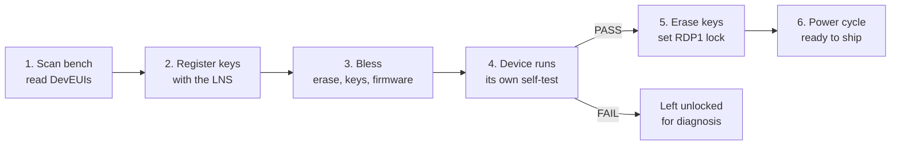

# Blessing Rig — Process Overview

| Property | Value |
|----------|-------|
| **Product** | FSO (Field Sensing & Occupancy) |
| **Audience** | Operators, production, anyone new to the rig |
| **Status** | In use |
| **Last updated** | 2026-09-15 |

> This is the short version. For parameters, error codes, script internals and service
> integration, see *Blessing Rig — Scaled Device Provisioning*.

---

## What blessing is

Blessing is the factory provisioning step. It turns a bare board into a device the LoRaWAN
network accepts, then proves the hardware works.

The rig handles **up to 6 devices at once**. Each device gets its own ST-LINK probe and its
own process, so one device cannot stall or fail another.

Measured: **4 devices blessed in 34 seconds**, including four network joins.

---

## The process



*Render with the Mermaid macro, or a Code Block macro set to `mermaid`.*

| Phase | What happens | Who does it |
|-------|--------------|-------------|
| 1. Scan | Read each device's DevEUI. Nothing is written. | `scan_device.ps1` |
| 2. Register | Mint keys and register them against the DevEUI. | Blessing service |
| 3. Bless | Erase the board, write the keys, flash the firmware, reboot. | `bless_rig.ps1` |
| 4. Self-test | The device checks its own hardware, then joins the network. | Device firmware |
| 5. Secure | On the devices that passed only: erase the keys, lock the debugger. | `bless_rig.ps1 -Secure` |
| 6. Power cycle | The lock takes effect. | Operator |

**Why phases 1 and 2 are separate.** The DevEUI comes from the chip. It cannot be chosen.
So the board has to be identified before its keys can be minted and registered. Keys must
reach the network **before** the device boots, because it tries to join within seconds of
being flashed.

---

## What the operator runs

Set the execution policy once per terminal:

```powershell
Set-ExecutionPolicy -Scope Process -ExecutionPolicy Bypass
```

**Check the bench.** Safe at any time. Reads only.

```powershell
.\scan_device.ps1
```

**Dry run.** Always do this for an unfamiliar command. Every real run erases its devices.

```powershell
.\bless_rig.ps1 -DeviceList .\rig_devices.csv -Stations 1,2,3 -DryRun
```

**Production run.** Blesses, then secures whatever passed.

```powershell
.\bless_rig.ps1 -DeviceList .\rig_devices.csv -Stations 1,2,3 -Region US915 `
                -Keys "1=<key>:<eui>,2=<key>:<eui>,3=<key>:<eui>" `
                -ReadVerdict -Secure
```

Then **power cycle the rig.**

---

## Pass and fail

The device reports its own result. Four things are checked:

| Check | Proves |
|-------|--------|
| PIR | The motion sensor triggers. |
| SPI flash | The external flash answers. |
| KTD I2C | The LED driver answers on I2C. This does **not** prove the LEDs light. |
| Network join | The device joined the LoRaWAN network. |

A device passes only when **every** check passes. There is no partial pass.

| Result | What happens to the device |
|--------|----------------------------|
| **PASS** | Keys erased, debugger locked, ready to ship. |
| **FAIL, hardware** | Left fully readable. The result names the failing part. |
| **FAIL, network join** | Left fully readable. Check the gateway before rejecting the board. |
| **No result** | Left fully readable. The device did not report in time. |

**A failed device is never locked and never erased.** It stays diagnosable, and it can be
blessed again.

If the hardware fails, the join is never attempted. Never report a join failure alongside
a hardware fault.

---

## What "secured" means

Two things happen to a device that passed:

1. **The keys are erased.** The AppKey, join identifier and region leave the board.
2. **The debugger is locked out.** Read-out protection level 1 is set. Flash can no longer
   be read over the debug port.

The lock applies on the next power-on reset. Until then the device still answers the
debugger.

**The lock is reversible.** STM32CubeProgrammer can unlock the device. Unlocking **erases
the whole board**, which is the point. A locked board is a reflash, not a write-off. It
then needs a full re-bless.

---

## Results at a glance

| Exit code | Meaning | Action |
|-----------|---------|--------|
| **0** | Every device passed and was locked. | Power cycle. Ship them. |
| **1** | Setup or configuration error. **Nothing was flashed.** | Fix the command or the device list. Re-run. |
| **2** | At least one device did not pass. | Read the per-device result. The failures are diagnosable. |
| **3** | Every device passed, but a lock failed. | Read the per-device result. Do not ship an unlocked board. |

A dry run also exits 0. Check whether the run was a dry run before reading a 0 as success.

---

## When something fails

| Symptom | First thing to check |
|---------|----------------------|
| A station reports no probe | The ST-LINK is not attached, or its serial is wrong in `rig_devices.csv`. |
| Connect or verify errors on one station | Lower the SWD clock. Pass `-Freq 8000`, then `-Freq 4000`. |
| Every device fails its network join | The gateway is unreachable, or the keys were never registered. Check the gateway first. |
| A device times out with no result | It did not reach the application. Reflash it. |
| A secured device still answers the debugger | The rig was not power cycled. |
| A device cannot be connected to at all | It is already locked. Unlock it in STM32CubeProgrammer. |
| Probes disappear from USB mid-run | A USB power or hub problem. This is the main production risk on this bench. |

Re-run with `-KeepLogs` to keep each device's output. That is the only place the programmer's
own error text survives.

---

## The safe operations

Two things can be done at any time without risk:

- **A scan.** It only reads. It is safe on an already blessed device.
- **A dry run.** It prints what would happen and touches no hardware. Keys are masked in
  its output, so it is safe to paste into a ticket.

Everything else erases a device.
