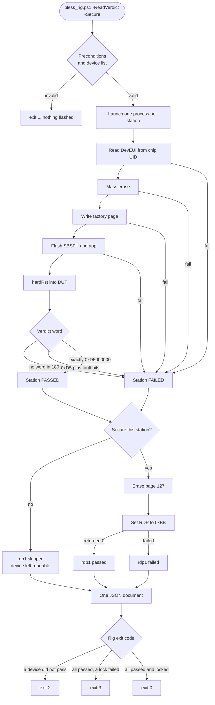

# Blessing Rig — Scaled Device Provisioning

| Property | Value |
|----------|-------|
| **Product** | FSO (Field Sensing & Occupancy) |
| **Scope** | Rig operation, script reference, DUT codes and service integration |
| **Location** | `C:\Freespace_Projects\Gen4\ScaledBlessing` |
| **Status** | In use |
| **Last updated** | 2026-09-15 |

> This page replaces three earlier pages: *Parallel Device Provisioning*,
> *Script Reference* and *DUT Error Codes*.

---

## 1. What blessing does

Blessing is the factory provisioning step. It turns a bare board into a device the LNS
accepts. The rig does this for up to six devices at once.

Each device goes through five operations:

1. Read the DevEUI from the chip UID. Nothing is written.
2. Mass erase the internal flash.
3. Write the factory page: op-code, AppKey, JoinEUI, region.
4. Flash the merged SBSFU and application image, then hard reset into it.
5. Let the device run its own DUT self-test and publish a verdict word in RAM.

Production adds two more operations. They run only on the devices that passed, only after
every verdict is in, and only when `-Secure` is passed:

6. Erase page 127, the factory page. The keys and the region leave the device.
7. Set RDP=0xBB, read-out protection level 1. The debugger can no longer read flash.

A device that failed its DUT is never touched by step 6 or step 7. It stays readable and
re-blessable.

Each station runs in its own `powershell.exe` process, bound to one ST-LINK probe by
serial number. One station cannot stall, fail or crash another.

Measured: **4 devices blessed in 34 seconds**, wall clock, including four OTAA joins.

---

## 2. The complete flow



*Render this with the Mermaid macro, or with a Code Block macro set to `mermaid`.*

Every branch above maps to one exit code from the station's own process:

| Branch | Station exit code | Device left in |
|--------|-------------------|----------------|
| DevEUI read failed | 1 | Untouched. Nothing was erased. |
| Mass erase failed | 2 | Unknown. Assume wiped. |
| Factory page write failed | 3 | Erased, no keys. |
| Firmware write failed | 4 | Erased, keys written, no application. |
| No verdict in `-VerdictTimeoutSec` | 5 | Fully flashed. The DUT did not report. |
| Verdict carried fault bits | 6 | Fully flashed and diagnosable. |
| Verdict was exactly `0xD5000000` | 0 | Fully flashed, joined, ready to secure. |

The securing gate is separate from the exit code. A station qualifies only when its
verdict is exactly `0xD5000000` **and** its exit code is 0 **and** it was not killed by
the overall timeout.

---

## 3. Rig layout

The op-code written to `0x0803F800` identifies the station to the firmware. The **low
nibble is the physical station**. The high nibble selects the frequency plan.

| Station | Op-code | Frequency plan | Join stagger |
|---------|---------|----------------|--------------|
| 1 | `0x11` | 1 | 0 ms |
| 2 | `0x22` | 2 | 2000 ms |
| 3 | `0x33` | 3 | 4000 ms |
| 4 | `0x14` | 1 | 6000 ms |
| 5 | `0x25` | 2 | 8000 ms |
| 6 | `0x36` | 3 | 10000 ms |

The firmware derives both values from the same byte:

```
freq_code = (op_code >> 4) & 0x0F
delay_ms  = ((op_code & 0x0F) - 1) * 2000
```

Stations 1/4, 2/5 and 3/6 share a frequency plan on purpose. What stops them from
transmitting on top of each other is the join stagger. **Do not reassign op-codes.**
`rig_layout.ps1` is the single source of truth and every script derives from it.

---

## 4. Files

| File | Role |
|------|------|
| `rig_layout.ps1` | Station to op-code map plus helpers. Dot-sourced by the other scripts. |
| `flash_device.ps1` | Per-device primitive. One probe, one device, start to finish. |
| `bless_rig.ps1` | Fan-out and monitor. One child process per selected station. Owns `-Secure`. |
| `scan_device.ps1` | Read-only bench scan. Reports each device's DevEUI. |
| `bless.bat` | Operator wrapper for `bless_rig.ps1`, for `cmd.exe`. |
| `scan.bat` | Operator wrapper for `scan_device.ps1`, for `cmd.exe`. |
| `rig_devices.csv` | This bench's `Position,SerialNumber` probe map. **Not portable.** |
| `rig_devices.example.csv` | Template for all six stations. Commit this one. |

```
bless.bat  --> bless_rig.ps1 --> flash_device.ps1   (one process per station)
scan.bat   --> scan_device.ps1                      (in process, no child spawn)

rig_layout.ps1 is dot-sourced by all three scripts (station -> op-code, one definition)
```

All three scripts call `STM32_Programmer_CLI.exe`, for different jobs.
`flash_device.ps1` does every erase, key write and firmware write. `scan_device.ps1`
enumerates probes and reads the chip UID. `bless_rig.ps1` calls it directly for one job
only: the page erase and the RDP write under `-Secure`.

### `rig_devices.csv`

```csv
Position,SerialNumber
1,001900393234510733353533
2,005100303233510A39363634
3,0050002A3234510836303532
4,003F00253234510733353533
```

| Column | Required | Meaning |
|--------|----------|---------|
| `Position` | Yes, or `OpCode` instead | Physical station, 1 to 6. Preferred. |
| `SerialNumber` | Yes | ST-LINK probe serial. |
| `OpCode` | No | Explicit override. Must match the station's canonical op-code. |
| `AppKey` | No | Per-device AppKey, 32 hex characters. |
| `JoinEui` | No | Per-device JoinEUI, 16 hex characters. |
| `Region` | No | Per-device region name. |

Prefer `Position`. It pins the op-code to the canonical layout, so an operator cannot pair
a station with the wrong frequency plan or stagger slot.

Get probe serials with `STM32_Programmer_CLI.exe -c port=SWD mode=HOTPLUG`. That output is
reliable. `-l` can garble serials on this host.

---

## 5. Prerequisites

- **STM32CubeProgrammer CLI** at
  `C:\Program Files\STMicroelectronics\STM32Cube\STM32CubeProgrammer\bin\STM32_Programmer_CLI.exe`.
  The path is set three times: `$CLI` in `flash_device.ps1`, the `-ProgrammerCli` default
  in `scan_device.ps1`, and `$CUBE_CLI` in `bless_rig.ps1` for `-Secure`. Keep them in step.
- **Firmware image** at
  `C:\Freespace_Projects\Gen4\fs-lorawan-gen4-monorepo\products\fso\ide\Binary\BFU_FSO.bin`.
  Override it per run with `-FirmwarePath`.
- **Execution policy.** The children are launched with `-ExecutionPolicy Bypass`. The
  parent needs the same. Use `powershell -NoProfile -ExecutionPolicy Bypass -File ...`,
  or run the `.bat` wrappers, which already do this.
- **`rig_devices.csv` populated** with this bench's probe serials.
- **A reachable gateway and LNS registration.** The mass erase wipes the LoRaWAN NVM at
  `0x0803F000`, so every blessing forces a fresh OTAA join. No gateway means every device
  reports `DUT FAIL`.

---

## 6. Scan the bench

`scan_device.ps1` answers one question. Which devices are on the bench, and what is each
one's DevEUI? **It reads only. No device is erased or written.** A scan is safe at any
time, including on an already blessed device.

Run it before a blessing. It collects the DevEUIs the LNS needs, and it confirms every
station is populated and its probe is alive.

```powershell
powershell -NoProfile -ExecutionPolicy Bypass -File .\scan_device.ps1
```

```
==== Rig scan ====

Station SerialNumber             DevEUI           State    Message
------- ------------             ------           -----    -------
      1 001900393234510733353533                  no probe ST-LINK not attached
      2 005100303233510A39363634 0080E1150636D6B5 ok
      3 0050002A3234510836303532                  no probe ST-LINK not attached
      4 003F00253234510733353533                  no probe ST-LINK not attached

3 station(s) did not report a DevEUI
```

Three steps: list the attached probes, map each serial to its station via
`rig_devices.csv`, then read each device's chip UID and derive its DevEUI.

The `State` column names every mismatch between the bench and the device list:

| State | Meaning |
|-------|---------|
| `ok` | Probe attached, DevEUI read. |
| `no probe` | The device list expects this station, but its ST-LINK is absent. |
| `not listed` | A probe is attached that `rig_devices.csv` does not describe. |
| `read failed` | The probe answered, the UID read did not. See `Message`. |

`read failed` covers two faults and the message does not separate them: **no board
seated**, and a **wrong serial** in `rig_devices.csv`. Tell them apart with a direct
connect. An empty socket reports a good voltage and `No STM32 target found!`.

Unlisted probes are reported even under `-Stations`. An unexpected probe is exactly what a
scan should surface. `bless_rig.ps1` will never select a probe the list does not describe.

### Why the scan is in process

Step 3 runs in `scan_device.ps1` itself. No child is spawned. Measured on the rig, this
removes about **1120 ms per station**: one `powershell.exe` start, plus the parse of the
21 KB `flash_device.ps1`, plus its `rig_layout.ps1` dot-source and the capture of its
stdout. All of that wrapped a single CLI call the parent can make itself.

One station, same probe and board, measured back to back:

| Script | Wall clock | DevEUI |
|--------|-----------|--------|
| Old `scan_rig.ps1` (child process per station) | 1991 ms | `0080E1150636E069` |
| `scan_device.ps1` (in process) | 871 ms | `0080E1150636E069` |

Identical DevEUI, so the copied byte order is correct.

The cost is a second copy of the DevEUI byte order. See *Rules that must not be broken*.

> Every CLI call passes `-q`. Do **not** rely on it for speed. On CubeProgrammer v2.16.0
> `-q` does not suppress the banner, which was observed printing in full. The gain comes
> entirely from not spawning a child process.

### Probe enumeration

`-l` output is filtered in two ways, because it is not trustworthy on this host:

- **Serials are de-duplicated.** `-l` prints one probe's serial twice, once under
  "STLink Interface" and again in its serial-port section. A raw parse reports two probes
  for one board and then scans it twice.
- **A serial must match `^[0-9A-Za-z]{8,32}$`.** With a probe in `DEV_CONNECT_ERR`, `-l`
  prints raw bytes where the serial belongs. Taking that literally invents a probe that
  does not exist and hides the real one.

When `-l` returns no usable serial, the script does not conclude the bench is empty. It
reads every listed station directly and reports what the connect actually says.

---

## 7. Bless the devices

Always dry-run an unfamiliar invocation first. **Every launch mass-erases its device.**

```powershell
powershell -NoProfile -ExecutionPolicy Bypass -File .\bless_rig.ps1 `
  -DeviceList .\rig_devices.csv -Stations 2,3,4 -Region US915 -DryRun
```

The AppKey is masked in the printed plan as `<32 hex, masked>`. A dry run exists to check
the launch plan, not the key bytes, so its output is safe to paste into a ticket.

### Bench run, shared bring-up keys

```powershell
powershell -NoProfile -ExecutionPolicy Bypass -File .\bless_rig.ps1 `
  -DeviceList .\rig_devices.csv -Stations 2,3,4 -Region US915 -ReadVerdict -KeepLogs
```

### Production run, unique keys and securing

```powershell
powershell -NoProfile -ExecutionPolicy Bypass -File .\bless_rig.ps1 `
  -DeviceList .\rig_devices.csv -Stations 1,2,3 -Region US915 `
  -Keys "1=<appKey1>:<joinEui1>,2=<appKey2>:<joinEui2>,3=<appKey3>:<joinEui3>" `
  -ReadVerdict -Secure -Json
```

Each device is flashed, runs its DUT and reports a verdict. Only the ones reporting exactly
`0xD5000000` then get their key page erased and RDP1 set. The rest are left alone.
**Power cycle the rig afterwards.** RDP1 does not take effect until a power-on reset.

Drop `-Json` for the operator view, which prints a securing table after the summary.

> `-Stations` must be **comma-separated**. Space-separating (`-Stations 3 4`) makes the `4`
> bind positionally to the next parameter and fails with a confusing complaint about
> `-Region`.

### Live output

```
  launched station 3 SN 0050002A3234510836303532 opcode 0x33 -> pid 31240
  launched station 4 SN 003F00253234510733353533 opcode 0x14 -> pid 27860

  [12:11:39] station 3  LAUNCH       running process starting
  [12:11:41] station 4  KEYS         running writing op-code 0x14, AppKey, JoinEUI, region US915
  [12:11:50] station 3  WAIT_VERDICT running DUT running; last read 0x00005776
  [12:12:10] station 3  DONE         passed  DUT PASS
  [12:12:12] station 4  DONE         passed  DUT PASS
```

The monitor polls every status file every 2 seconds and prints a line only when a station
changes step or state. A three-minute verdict wait therefore does not bury the other
stations' transitions. A station moving faster than the poll may skip a line. The status
file is a current-state snapshot, not an event log.

When `-OverallTimeoutSec` expires, any process still running is killed and that station's
status file is stamped with state `error`. A killed child cannot write its own terminal
state, so the UI would otherwise show it mid-step forever.

### Summary

Default output is two columns, `Station` and `Verdict`. A station with no verdict word shows
its result text instead, so the column always says something. `-FullSummary` prints serial,
op-code, DevEUI, verdict, faults, exit code and result text.

The summary prefers the structured status file and falls back to scraping the child log.
Result classification prefers the exit code. When there is no exit code but a verdict was
logged, the verdict is decoded instead. A process bookkeeping problem can therefore never
misreport a device that actually passed.

### Logs and cleanup

By default nothing survives the run. The run directory is kept when any of these is true:

- `-KeepLogs` was passed.
- `-LogDir` or `-StatusDir` was passed explicitly.
- `-NoWait` was passed.

The log and status files are not optional machinery. `Start-Process` can only redirect a
child's output to a real file, and the monitor works by reading the status files. A run
always writes them. `-KeepLogs` only decides whether they survive.

**The child log is the only place the `STM32_Programmer_CLI` error text survives.** Re-run
with `-KeepLogs` to diagnose a failure.

### Device list validation

Validation runs against the whole list, not just the selected rows. All of these are
refused with exit 1, before any device is touched:

- Missing `SerialNumber` column.
- Neither a `Position` column nor an `OpCode` column.
- A `Position` outside 1 to 6.
- An explicit `OpCode` that disagrees with its `Position`.
- A row with an empty `SerialNumber`, or with neither a `Position` nor an `OpCode`.
- An `OpCode` outside the canonical set.
- A duplicate `SerialNumber`. Two processes would fight over one probe.
- A duplicate `OpCode`. Two devices would share a join-stagger slot.
- A requested station with no row in the list.

### `-Keys` and key precedence

Format is `station=<32 hex appKey>:<16 hex joinEui>`, comma-separated.

Precedence, lowest to highest: `flash_device.ps1` bring-up defaults, then the device-list
column, then `-Region` for the whole run, then `-Keys` per station.

Keys are checked **before any device is erased**, because a station rejected mid-run would
already have lost its keys and NVM:

| Condition | Behaviour |
|-----------|-----------|
| Malformed entry | Refuse the run |
| Same AppKey or JoinEUI on two stations | Refuse the run |
| Keys given for a station not in this run | Refuse the run. The allocation and the station list disagree. |
| Selected station with no keys | Warn, mark `default` in the launch table, proceed |

---

## 8. Secure a production device

`-Secure` is the last stage of a production run. It is **off by default and must stay that
way.** A bring-up blessing that locked its board would cost the engineer a mass erase to
recover.

`-Secure` runs after every verdict is in and before any output. That ordering is why it
lives in `bless_rig.ps1` rather than a separate script. The single JSON document then
carries the verdicts and the securing result together. Securing after the JSON was printed
would leave the caller with no machine-readable record of the one step that erases and
locks.

### Preconditions

All are checked before anything runs. Each one exits 1:

- **`-ReadVerdict` is required.** The pass test is the verdict word. Without it no station
  could qualify, and `-Secure` would be an expensive no-op that looked like it worked.
- **`-NoWait` is refused.** That mode returns before a single verdict exists.
- **`STM32_Programmer_CLI.exe` must exist** at the path in `$CUBE_CLI`.

### Who qualifies

A station is secured only when all three hold:

- Its verdict word is exactly `0xD5000000`, the signature with every fault bit clear.
- Its exit code is 0.
- It was not killed by `-OverallTimeoutSec`.

Exit 0 alone is not enough. A run without `-ReadVerdict` also exits 0, for "flashed and
rebooted, verdict not polled". The verdict is compared numerically, not as a string,
because it is scraped from a log and `0xd5000000` in lower case must still match.

Everything else is skipped and left fully readable.

### What runs

Two rounds, all qualifying stations at once, one process per station:

| Round | Command | Effect |
|-------|---------|--------|
| 1 | `-c port=SWD sn=<SN> mode=UR -e 127` | Erases page 127 at `0x0803F800`. The AppKey, JoinEUI, op-code and region leave the device. |
| 2 | `-c port=SWD sn=<SN> mode=UR -ob RDP=0xBB` | Sets read-out protection level 1. The debugger can no longer read flash. |

`mode=UR`, under reset, is what the proven `enable_security.bat` used. It matters for the
option-byte write. Do not change it to `HOTPLUG` without testing the RDP path.

Page 127 is therefore erased **twice** in a secured run, for opposite reasons. The mass
erase at the start of the flash clears it so the factory page can be written. Round 1 here
clears it again at the end, so the keys do not leave the building. Without `-Secure` only
the first erase happens, and the device ships with its keys readable in flash.

Round 2 is fired **even if round 1 failed**, and the two results are reported separately.
A `Locked` device with `Cleared` false is the one outcome worth stopping for. Its keys are
still in flash, protected only by RDP1. The operator view prints that in red.

```
Station Cleared Locked Rdp1   Message
------- ------- ------ ------ -------
      1    True   True passed
      3    True  False failed lock: Error: Option Byte Programming failed
```

RDP1 restricts the **debugger's** access to flash, not the CPU's. Application firmware can
still erase its own pages after the lock.

**Power cycle the rig.** Option bytes load on a power-on reset only. Until then a locked
device still answers the debugger, which reads as "the lock did not work".

### Nothing is read back

By decision, there is no page read-back after the erase and no option-byte read-back after
the lock. `rdp1: "passed"` means the programmer returned 0 and nothing more.

What can be checked on a finished device is limited, because blocking debug reads of flash
is exactly what RDP1 does:

```powershell
$cli = "C:\Program Files\STMicroelectronics\STM32Cube\STM32CubeProgrammer\bin\STM32_Programmer_CLI.exe"

# Works on a locked device. Option bytes stay readable at RDP1.
& $cli -q -c port=SWD sn=<SN> mode=UR -ob displ | Select-String RDP     # expect RDP : 0xBB

# FAILS on a locked device. That failure is itself evidence the lock is live.
& $cli -q -c port=SWD sn=<SN> mode=UR -r32 0x0803F800 56
```

**So the erase cannot be confirmed after the lock.** Once RDP1 is set, page 127 is
unreadable either way, and a blank page and a live key page look identical from outside.
Prove the erase works once, by hand, on a board you are willing to wipe:

```powershell
& $cli -q -c port=SWD sn=<SN> mode=UR -e 127
& $cli -q -c port=SWD sn=<SN> mode=UR -r32 0x0803F800 56    # expect all FFFFFFFF
```

That is the same `-e 127` the script fires, and it has been confirmed on this bench. It is
a one-off check on the mechanism, not a per-run verification.

A real verification would have to read page 127 **between** the two rounds and refuse to
lock a station whose page is not blank. That is the change to make if the erase is ever
suspected.

### Unlocking

RDP1 is reversible. Regress it to level 0 from the STM32CubeProgrammer GUI, or with:

```powershell
STM32_Programmer_CLI.exe -c port=SWD sn=<SN> mode=UR -ob RDP=0xAA
```

That **mass erases the device** and hands it back blank, which is the point. A locked board
is a reflash, not a write-off. It then needs a full re-bless.

> RDP2, `0xCC`, is a different thing and the rig never writes it. It erases nothing and it
> has no regression path at all. The device can never be debugged again. The level is a
> constant in `bless_rig.ps1`, not a parameter, because one character separates the two.

---

## 9. Production flow, unique keys per blessing

The AppKey and JoinEUI must be registered against the DevEUI **before the device boots**.
`-hardRst` at the end of the flash step sends it straight into the DUT, and it attempts
OTAA within seconds. There is no window afterwards in which to register.

The DevEUI is not assignable. It comes from the chip UID, so keys cannot be chosen until
the board in the slot has been identified. That forces two phases per station:

```
1  read DevEUI     scan_device.ps1 -Json -Stations N
                   -> DevEUI: 0080E1150636DF36      (no erase, no reset)

2  service         mint AppKey (16 B) + JoinEUI (8 B)
                   register (DevEUI, JoinEUI, AppKey) with the LNS
                   ...wait for confirmation...

3  bless           bless_rig.ps1 -Stations N -Keys "N=<appKey>:<joinEui>" `
                                 -ReadVerdict -Secure
                   erase -> factory page -> firmware -> hardRst -> DUT -> verdict

4  secure          same script, same run, PASSED stations only:
                     erase page 127   -> keys and region leave the device
                     -ob RDP=0xBB     -> debugger locked out
                   FAILED stations are not touched at all

5  result          PASS -> keep the LNS device; power cycle the rig so RDP1 applies
                   FAIL -> delete that LNS device; a re-bless mints new keys
```

Steps 3 and 4 are **one invocation**. Securing in a second call would leave a window in
which a passed device still holds readable keys.

`flash_device.ps1 -ReadDevEuiOnly` is the single-device equivalent of step 1. It reports
the DevEUI and exits **before** the erase, so it is safe on a board you have not committed
to reflashing.

> **Writing a key the LNS does not know produces a device that flashes cleanly and then
> fails its join, reporting `DUT FAIL`.** Register first.

### Key generation, service side

| Field | Length | Guidance |
|-------|--------|----------|
| AppKey | 32 hex chars = **16 bytes**, AES-128 | Must be unguessable. Use a CSPRNG (`crypto.randomBytes`) for the random portion. |
| JoinEUI | 16 hex chars = **8 bytes**, EUI-64 | An identifier, not a secret. Uniqueness is all that is required. |

An epoch prefix plus CSPRNG padding is sound. The epoch gives uniqueness and the random
padding gives entropy. Two cautions:

- Use **epoch seconds**, 10 digits. `Date.now()` is 13 digits and eats into the padding.
- With several stations blessing in the same second, the epoch prefix is *identical*. The
  random padding is then the only thing keeping the keys apart. It must come from a
  CSPRNG, not `Math.random()` seeded per worker.

Put a unique constraint on AppKey and JoinEUI in the blessing table. A generation bug then
surfaces as an insert failure rather than two devices quietly sharing a root key.

---

## 10. Parameters

### `bless_rig.ps1`

| Parameter | Default | Purpose |
|-----------|---------|---------|
| `-DeviceList` | *required* | CSV describing the rig. |
| `-Stations` | all rows | Stations to run, comma-separated. |
| `-Region` | per-CSV / `US915` | One region for the whole run. Overrides the CSV column. |
| `-Keys` | none | Per-station key material. See section 7. |
| `-ReadVerdict` | off | Wait for each DUT verdict and report it. |
| `-Secure` | off | **Production.** Clear the key page and set RDP1 on the devices that passed. Requires `-ReadVerdict`, refuses `-NoWait`. |
| `-FirmwarePath` | script default | Image for every station. |
| `-LogDir` | `%TEMP%\fso_rig\<timestamp>` | Per-station stdout and stderr. |
| `-KeepLogs` | off | Keep the run directory instead of deleting it. |
| `-StatusDir` | `<LogDir>\status` | Where the `station<N>.json` files land. |
| `-NoWait` | off | Launch and return immediately. Implies `-KeepLogs`. |
| `-Freq` | `24000` | SWD clock in kHz. Drop to `8000` or `4000` if a probe is marginal. |
| `-VerdictTimeoutSec` | `180` | Passed to each child. |
| `-OverallTimeoutSec` | `600` | Cap on the whole monitored run. Stragglers are killed. |
| `-FullSummary` | off | Print the full summary table instead of two columns. |
| `-Json` | off | Print one JSON document and nothing else. |
| `-DryRun` | off | Print the launch plan. Touch no hardware. |

`-Stations` and `-Keys` are typed `[string[]]`, not `[int[]]`. Under `powershell.exe -File`
every argument arrives as a string, and `"1,3"` coerced to `[int]` becomes `13`. Both
parameters are parsed by hand.

### `flash_device.ps1`

| Parameter | Default | Purpose |
|-----------|---------|---------|
| `-Station` | `1` | Rig station 1 to 6. Sets the op-code and resolves the probe. |
| `-AppKey` | `2B7E151628AED2A6ABF7158809CF4F3C` | 32 hex characters, MSB first, as the LNS shows it. |
| `-JoinEui` | `0E0D0D010E01020E` | 16 hex characters, MSB first. |
| `-Region` | `US915` | One of the ten supported region names. |
| `-SerialNumber` | from the CSV | Explicit probe serial. Wins over the device list. |
| `-FirmwarePath` | `BFU_FSO.bin` | Image flashed to `0x08000000`. |
| `-Freq` | `24000` | SWD clock in kHz. |
| `-ReadVerdict` | off | Poll the DUT verdict word and report pass or fail. |
| `-VerdictTimeoutSec` | `180` | Verdict poll budget. |
| `-ReadDevEuiOnly` | off | Read the DevEUI and exit. Nothing is erased or written. |
| `-StatusFile` | none | Write machine-readable progress to this path. |

The defaults for `-AppKey` and `-JoinEui` are shared bring-up values, for bench work only.
A production blessing must pass unique key material.

This script never touches the option bytes, and it never erases the factory page it just
wrote. Locking a device is `bless_rig.ps1 -Secure`, and it happens after the verdict.

The probe is resolved in three steps. An explicit `-SerialNumber` wins. Otherwise the
script reads this station's row from `rig_devices.csv`. Otherwise it leaves `sn=` off and
lets the CLI use the only attached probe.

### `scan_device.ps1`

| Parameter | Default | Purpose |
|-----------|---------|---------|
| `-DeviceList` | `rig_devices.csv` beside the script | Probe map. A missing list is not fatal. |
| `-Stations` | whole bench | Scan only these stations, comma-separated. |
| `-Json` | off | Emit the rows as JSON instead of a table. |
| `-Freq` | `24000` | SWD clock in kHz. |
| `-ProgrammerCli` | STM32CubeProgrammer path | Second copy of the CLI path. |

A missing device list is not fatal. The scan then reports every attached probe with no
station number, which is still the DevEUI answer the caller wanted.

**Pass `-Stations` to match the blessing call.** Without it the scan covers every row in
`rig_devices.csv`, so a bench running two boards out of four always exits 2.

### Station sequence and failure points

| Step | Action | Failure exit code |
|------|--------|-------------------|
| `START` | Resolve station, op-code, probe and firmware path. | 1 |
| `DEVEUI` | Read the chip UID and compute the DevEUI. | 1 |
| `ERASE` | `-e all`, connect mode `UR`. | 2 |
| `KEYS` | Write the 56-byte factory page at `0x0803F800`, verified. | 3 |
| `FLASH` | Write the image at `0x08000000`, verified, with `-hardRst`. | 4 |
| `WAIT_VERDICT` | Poll `0x20003400` every 3 s, connect mode `HOTPLUG`. Opt-in. | 5 |
| `DONE` | Decode the verdict word. | 6 on a DUT fail |

The firmware image is checked for existence **before** the erase, so a missing image can
never leave a wiped device. That check is skipped under `-ReadDevEuiOnly`, which never
flashes. That path must work on a machine with no current build.

The DevEUI is read before the erase. This catches a dead or absent probe early, and it
gives the service the DevEUI it needs for LNS registration.

---

## 11. What gets written

### DevEUI derivation

The DevEUI comes from the chip UID, not from the factory page. The scripts mirror
`GetUniqueId()` in `common/board/src/sys_app.c`.

- Primary source is the 64-bit UID at `0x1FFF7580`.
- When the UDN word reads `0xFFFFFFFF`, the script falls back to the 96-bit UID at
  `0x1FFF7590` and folds it the way the firmware does.

### Factory page at `0x0803F800`

56 bytes (`0x38`), filled with `0xFF`.

| Offset | Address | Size | Content |
|--------|---------|------|---------|
| `0x00` | `0x0803F800` | 4 | Op-code, little-endian word. |
| `0x10` | `0x0803F810` | 16 | AppKey, **byte-reversed**. |
| `0x20` | `0x0803F820` | 8 | JoinEUI, **byte-reversed**. |
| `0x30` | `0x0803F830` | 4 | Region ID byte, then three zero bytes. |

**Byte order is not cosmetic.** `keys_update.c` reads these back as `ptr[15 - i]` and
`ptr[7 - i]`. Writing them in natural order yields a device that provisions cleanly and
then silently never joins.

**The region address is `0x0803F830`**, as defined in `common/lora/keys_update.h`. That is
the address its only consumer actually reads. `device_dut.h` once also defined
`REGION_FLASH_ADDR` as `0x0803F840`, which nothing read. Provisioning to that address
leaves the region as `0xFF`, and the firmware blinks amber forever in
`UpdateKeysAndRegion()`. That stale definition has been removed.

To verify a written key, remembering the reversal:

```powershell
STM32_Programmer_CLI.exe -c port=SWD freq=24000 mode=HOTPLUG sn=<probe> -r8 0x0803F810 16
```

### Region IDs

| Name | ID | Name | ID |
|------|----|------|----|
| `AS923` | 0 | `KR920` | 6 |
| `AU915` | 1 | `IN865` | 7 |
| `CN470` | 2 | `US915` | 8 |
| `CN779` | 3 | `RU864` | 9 |
| `EU433` | 4 | | |
| `EU868` | 5 | | |

---

## 12. DUT verdict codes

One 32-bit word at `0x20003400`. The rig reads it over SWD.

```
 31    24 | 23    16 | 15     8 | 7      0
   0xD5   |   0x00   |  stage 2 |  stage 1
signature   reserved   faults     faults
```

A word counts as a verdict only when the signature byte is `0xD5` and the reserved byte is
zero. Pass or fail is then the fault bits alone. Zero faults means pass.

### Fault bits

| Bit | Mask | Part | Set when |
|-----|------|------|----------|
| 0 | `0x0001` | PIR | No trigger seen in the 15 x 500 ms window |
| 1 | `0x0002` | SPI flash | `Ext_Flash_DUT()` failed |
| 2 | `0x0004` | KTD2026 | No I2C ACK from the LED driver |
| 3 | `0x0008` | — | **Reserved. Never set on FSO.** Do not reuse it. |
| 4-7 | — | spare | Future stage-1 parts |
| 8 | `0x0100` | OTAA join | Join was attempted and got no accept |
| 9-15 | — | spare | Future stage-2 checks |

Bits 0-2 and bit 8 are the only bits FSO ever sets. Bit 3 stays reserved so the bit list
holds one meaning per bit as more parts are added.

### Every code the rig returns

| Code | Meaning | Action |
|------|---------|--------|
| `0x00000000` | DUT still running | Keep polling. Not a failure. |
| `0xD5000000` | **PASS** | Ship the board. |
| `0xD5000001` | PIR | Reject. Check the PIR and its trigger path. |
| `0xD5000002` | SPI flash | Reject. Check the external flash. |
| `0xD5000003` | PIR + SPI flash | Reject. |
| `0xD5000004` | KTD2026 | Reject. Check the I2C bus and the LED driver. |
| `0xD5000005` | PIR + KTD2026 | Reject. |
| `0xD5000006` | SPI flash + KTD2026 | Reject. |
| `0xD5000007` | PIR + SPI flash + KTD2026 | Reject. Suspect power or the whole I2C bus. |
| `0xD5000100` | Hardware passed, OTAA join failed | Check gateway reach and LNS registration before rejecting the board. |

Ten values. That is the complete list for FSO.

### Reading a code by eye

The last hex digit is the hardware result. Add the parts up.
**PIR = 1, SPI flash = 2, KTD2026 = 4.**

| Digit | Parts | Digit | Parts |
|-------|-------|-------|-------|
| `1` | PIR | `5` | PIR + KTD |
| `2` | flash | `6` | flash + KTD |
| `3` | PIR + flash | `7` | all three |
| `4` | KTD | | |

A `1` in the third-from-last position is the join: `0xD5000100`.

### The join rule

**If any of bits 0-2 is set, the join was never attempted.**

`main.c` gates the join on `g_bHwDutPassed`. On a hardware failure, `b_loraJoinFlag` stays
false because nothing tried, not because the join failed. The join bit is therefore
meaningful only on `0xD5000100`, where the hardware passed.

Report "join not attempted" for any code with a hardware bit set. Never report "join
failed". This is why `0xD5000107` is a code you will never see.

### What a KTD pass does and does not prove

Bit 2 clear means the KTD2026 answered on I2C. **It is not proof the LEDs light.** It
cannot detect a fault in the LED supply path, the CH pins, or the LED itself. A batch
passed this check with dark LEDs on 2026-08-25. The root cause was a missing resistor on
the 3V3 path feeding the LED anode rail.

Label this fault "KTD I2C", not "LED", so `0xD5000000` is never read as an LED pass.

### The pass word gates production securing

`bless_rig.ps1 -Secure` erases the key page and sets RDP1 on a station only when its
verdict word is exactly `0xD5000000` **and** its exit code is 0. Every other value in the
table above, `0x00000000` for "still running" included, leaves the device untouched and
fully readable.

There is no tolerance in that test. A device with any fault bit set keeps its keys in flash
and keeps its debug access, so it can be diagnosed and re-blessed. A device that passes is
erased and locked, and getting back in costs a mass erase.

This is also why the rig refuses `1` and `2` as verdicts. A pre-coded firmware reporting
`1` for pass would otherwise have its keys erased and its debugger locked on the strength
of a value that proves nothing about the hardware.

### Values that are not a verdict

| Value | Meaning |
|-------|---------|
| `0x00000000` | DUT still running, or the word was just cleared. Keep polling. |
| `0x00005776` | SBSFU's `uFlowCryptoValue` (`FLOW_CTRL_INIT_VALUE`). SBSFU has not handed over yet. |
| `0x00000001` | **Pre-coded pass.** Firmware built before the coded scheme. Not accepted. |
| `0x00000002` | **Pre-coded fail.** Not accepted. |
| anything else with a high byte that is not `0xD5` | Stale RAM. Not a verdict. |

A code carrying a bit the rig has no name for is reported as `unknown fault bits 0xNNNN`
and counts as a **fail**. That is deliberate. Newer firmware read by an older rig must fail
loudly rather than pass a board silently.

The pre-coded `1` and `2` are **not** decoded. Only the `0xD5` signature makes a word a
verdict, so a board still holding a pre-coded image runs to `VERDICT TIMEOUT` (exit 5). The
timeout output names the value and tells the operator to reflash. Those builds are
bench-only and are not going to production, and `1` and `2` are ambiguous against any
future scheme that uses small integers.

### Memory map around the word

Verified against `FSO.map` and a live SWD read.

| Address | Owner | Notes |
|---------|-------|-------|
| `0x20003400` | `g_u32DutResult` | The verdict. `DUT_RESULT` region, 4 bytes. |
| `0x20003404` | nothing | Dead pad. No section owns it. Holds stale bytes. |
| `0x20003408` | `RAM1` / `.data` | Device RAM starts here. First word is `SystemCoreClock`. |

`g_u32DutResult` lives in its own `.dut_result` section at the very start of the application
RAM region, pinned by `ide/STM32WL55JCIX_FLASH.ld`. Two hard constraints:

- **Reads must use `mode=HOTPLUG`.** SBSFU's `.data` starts at exactly `0x20003400`, so any
  reset overwrites the verdict before the application can publish it.
- **The linker region must not be removed.** The pad at `0x20003404` exists for alignment.
  RAM1's origin must stay 8-byte aligned, because `.data` opens with `. = ALIGN(8)`. If that
  padding is emitted inside the section, the section's LMA and VMA drift by 4 bytes while
  `_sidata`/`_sdata` do not, and the startup copy reads the wrong flash offset. Every
  initialised global then comes up shifted by one word, **with no build error**.

**Do not reclaim the pad** by dropping `DUT_RESULT_RESERVED` to `0x4`. That re-creates
exactly that bug. The pad is available for a future second word at zero cost: raise
`DUT_RESULT_SIZE` to `0x8` and leave `DUT_RESULT_RESERVED` at `0x8`, and RAM1 does not move.

Drop the `DUT_RESULT` region while `device_dut.c` still targets `.dut_result` and the
section becomes an orphan placed after `.data`, so the rig silently reads SBSFU's
`uFlowCryptoValue` instead of the verdict. Commit the linker script **together with** the
code that depends on it.

---

## 13. Exit codes

### `flash_device.ps1`, one device

| Code | Meaning |
|------|---------|
| 0 | Flashed and rebooted. With `-ReadVerdict`, the DUT also passed. |
| 1 | Setup error. Bad probe, unreadable UID, or missing firmware image. |
| 2 | Mass erase failed. |
| 3 | Factory page write failed. |
| 4 | Firmware write failed. |
| 5 | Verdict timeout. No verdict within `-VerdictTimeoutSec`. |
| 6 | **DUT fail.** The verdict code says which part. |

Exit code 6 covers every fault combination. Splitting it per fault would need eight codes.
The decoded fault list belongs in the message and the status file instead.

### `bless_rig.ps1`, the whole rig

| Code | Meaning |
|------|---------|
| 0 | Every device passed. With `-NoWait`, every process launched. |
| 1 | Setup or validation error. Nothing was flashed. |
| 2 | At least one device did not pass. |
| 3 | Every device passed, but securing failed on at least one. `-Secure` only. |

Exit 2 takes precedence over exit 3. A device that did not pass was never a candidate for
securing, so a blessing failure is always reported as 2. Exit 3 means specifically "the
blessing was clean, the lock was not". It is also returned when `-Secure` ran but no
station qualified, because that is a production run that shipped nothing.

Read each station's `rdp1` field rather than inferring the lock from the exit code.

`-DryRun` also exits 0. **Do not read a 0 as "devices passed"** without checking whether
the run was a dry run.

### `scan_device.ps1`, read DevEUIs, writes nothing

| Code | Meaning |
|------|---------|
| 0 | Every listed station reported a DevEUI. |
| 1 | Setup error. No device was read. |
| 2 | A listed station is empty, or a DevEUI read failed. |

A `not listed` probe that reads successfully is a warning. It does not change the exit
code. Do not treat a non-zero exit as "the scan broke". The DevEUIs it did read are still
valid, and `failed` tells you how many stations did not answer.

---

## 14. Machine-readable interfaces

### Live progress: status file, `<StatusDir>\station<N>.json`

Use `-NoWait -StatusDir` for live progress. Do not use `-Json` for progress. `-Json` is for
the blocking "run it and give me the result" call.

With `-NoWait`, the rig launches the station processes and returns immediately. Each station
owns its probe for its whole run, so nothing else may connect to that ST-LINK while it is
blessing.

```powershell
.\bless_rig.ps1 -DeviceList .\rig_devices.csv -Stations 1,3 -Region EU868 `
                -Keys "1=...:...,3=...:..." -ReadVerdict -NoWait -StatusDir C:\blessing\status
```

```json
{
  "station": 1,
  "opCode": "0x11",
  "serialNumber": "001900393234510733353533",
  "devEui": "0080E1150636DF36",
  "region": "EU868",
  "step": "WAIT_VERDICT",
  "state": "running",
  "message": "DUT running; last read 0x00000000",
  "exitCode": null,
  "verdict": "",
  "faults": [],
  "pid": 12345,
  "startedUtc": "2026-09-09T09:14:02.1234567Z",
  "updatedUtc": "2026-09-09T09:14:49.7654321Z",
  "elapsedSec": 47
}
```

| Field | Notes |
|-------|-------|
| `step` | `LAUNCH`, `START`, `DEVEUI`, `ERASE`, `KEYS`, `FLASH`, `WAIT_VERDICT`, `DONE`. |
| `state` | `running`, `passed`, `failed`, `error`. This drives the station indicator. |
| `devEui` | Available from the `DEVEUI` step onward, before anything is erased. |
| `verdict` | Raw verdict word as hex, once one has been read. |
| `faults` | Decoded fault names for that word. |
| `exitCode` | Null until the run ends. |
| `elapsedSec` | Seconds since this station's own process started. |

`LAUNCH` is written by `bless_rig.ps1` as a seed. Every other step is written by the child.
If a child dies before writing one, the UI still shows that station as launching and then
stale, rather than showing no row.

The file is written to a `.tmp` name and then renamed, so a reader never parses a
half-written file. Every status write is best effort. A status write can never fail a flash.
The `WAIT_VERDICT` step refreshes on every poll, so the UI can show that the station is
alive and how long it has waited.

**No key material is ever written to the status file or the logs.**

### `bless_rig.ps1 -Json`

Prints one JSON document and nothing else. Every human-facing line is suppressed by
shadowing `Write-Host` with an empty function.

```json
{
  "stations": [
    { "station": 2, "serialNumber": "0051...3634", "devEui": "0080E1150636D6B5",
      "verdict": "0xD5000000", "exitCode": 0, "passed": true, "killed": false,
      "rdp1": "passed" },
    { "station": 3, "serialNumber": "0050...3532", "devEui": "0080E1150636C932",
      "verdict": "0xD5000001", "exitCode": 6, "passed": false, "killed": false,
      "rdp1": "skipped" }
  ],
  "total": 2, "passed": 1, "failed": 1,
  "secureRequested": true, "secured": 1, "secureFailed": 0
}
```

Dry-run document:

```json
{ "dryRun": true, "stations": [1, 3], "total": 2 }
```

**Check the exit code before parsing.** Exit 1 fails before any station runs, so **stdout
is empty**. Exit 0, 2 and 3 all emit the document. A dry run emits its own document, so a
caller can parse unconditionally whenever the exit code is 0.

`verdict` is `""` when no verdict word was read. `exitCode` then says why. `killed` marks a
station stopped by `-OverallTimeoutSec`, the one case where `exitCode` can be `null`.

`opCode`, `faults` and `result` are left out on purpose, because the consumer derives them.
The op-code is fixed per station by `rig_layout.ps1`. The faults are decoded from the
verdict bits. The result is prose, and `exitCode` carries the same classification as a
number. The terminal tables still show all three.

**The securing fields are always present**, with or without `-Secure`, so there is no
conditional schema to branch on:

| `rdp1` | Meaning |
|--------|---------|
| `not requested` | `-Secure` was off. Nothing was erased or locked. |
| `skipped` | `-Secure` was on, but this station did not cleanly pass. Left untouched. |
| `passed` | The RDP write returned 0. This device is locked. |
| `failed` | The RDP write did not return 0. This device is **not** locked. |

`secureRequested` separates "nothing qualified" from "securing was never asked for". Both
report `secured: 0`. `secured` counts the `passed` stations and `secureFailed` the `failed`
ones.

`rdp1` reports the **lock** only. The page erase has no field of its own. **That is a real
blind spot under `-Json`.** A station whose erase failed but whose lock succeeded still
reports `rdp1: "passed"`, so a consumer reading only the JSON cannot tell that the keys are
still in flash. The failed erase is visible in the operator view alone. Add a `cleared`
field to the station row if the service ever needs to gate on it.

### `scan_device.ps1 -Json`

Same envelope and the same camelCase names, so one consumer reads both. The document is
always an object with a `stations` array plus counts. It is never a bare array. `station`,
`serialNumber`, `devEui` and `exitCode` mean the same thing in both documents.

```json
{
  "stations": [
    { "station": 1, "serialNumber": "001900393234510733353533",
      "devEui": "0080E1150636CED9", "state": "ok", "message": "", "exitCode": 0 }
  ],
  "total": 1, "ok": 1, "notListed": 0, "failed": 0
}
```

`station` is `null` for a `not listed` probe. `exitCode` is 0 when the DevEUI was read and 1
when the read failed. It is `null` for a station the scan never attempted. The scan reads
the UID in its own process, so this is not a child process's exit code.

The counts mirror the exit code. **`failed > 0` is exactly when this script exits 2.**

### Decoding a verdict in Node

```js
const p = spawn('powershell.exe', [ /* ... */, '-ReadVerdict', '-Secure', '-Json' ]);
let buf = '';
p.stdout.on('data', d => buf += d);
p.on('close', code => {
  if (code === 1) throw new Error('rig setup error');   // stdout is empty
  const r = JSON.parse(buf);
  for (const s of r.stations) {
    console.log(s.station, s.verdict, decodeFaults(s.verdict), s.rdp1);
  }
});

// Verdict word: 0xD5 signature | reserved | stage-2 faults | stage-1 faults.
// Zero fault bits means pass.
const FAULT_BITS = [
  [0x0001, 'PIR'], [0x0002, 'SPI flash'], [0x0004, 'KTD I2C'], [0x0100, 'OTAA join'],
];

function decodeFaults(verdict) {
  if (!verdict) return ['no verdict'];
  const w = parseInt(verdict, 16) >>> 0;              // >>> 0 keeps it unsigned
  if ((w & 0xFF000000) >>> 0 !== 0xD5000000) {
    return ['not a verdict'];                         // includes pre-coded 1 and 2
  }
  const bits = w & 0xFFFF;
  if (bits === 0) return [];                          // pass
  const named = FAULT_BITS.filter(([b]) => bits & b).map(([, n]) => n);
  const unknown = bits & ~FAULT_BITS.reduce((a, [b]) => a | b, 0) & 0xFFFF;
  if (unknown) named.push(`unknown bits 0x${unknown.toString(16)}`);
  return named;
}
```

A stage-1 bit means the join was **never attempted**. Never report a join failure alongside
a hardware fault.

---

## 15. Operator wrappers

Both wrappers exist for two reasons. This machine runs with the default `Restricted`
execution policy, so `.\bless_rig.ps1` is refused with "running scripts is disabled on this
system". And `cmd.exe` needs the argument handling below. The `-ExecutionPolicy Bypass`
applies to one process only and changes no machine setting.

Arguments are forwarded verbatim through `%*`. They are **not** parsed positionally.
`cmd.exe` treats a comma as an argument separator. Read through `%1 %2 %3`, `bless 2,3,4`
would arrive as three separate arguments and the `3` would bind to `-Region`, failing with
`The argument "3" does not belong to the set ...`. `%*` keeps the comma list intact.

A first character that is not a dash is treated as a bare station list. `bless 2,3,4` and
`bless -Stations 2,3,4` are equivalent. All paths are built from `%~dp0`, so both wrappers
work from any working directory. A wrong current directory is the usual cause of "is not
recognized".

### `bless.bat`

Pre-fills `-DeviceList` and `-ReadVerdict`. Everything else is forwarded unchanged.

```bat
bless 2,3,4                        REM stations 2, 3 and 4, region US915
bless 1,3 -Region EU868            REM stations 1 and 3 as EU868
bless 2,3,4 -DryRun                REM print the launch plan, touch no hardware
bless 2,3,4 -KeepLogs              REM keep each station's output
bless 2,3,4 -Freq 8000             REM any bless_rig.ps1 parameter works
bless 3,4 -Keys "3=<32 hex>:<16 hex>,4=<32 hex>:<16 hex>"
bless                              REM usage
```

`-Keys` survives cmd's parser both quoted and unquoted. Hex, `=`, `:` and `,` are all safe
as a single token. Quote it anyway out of habit.

The wrapper prints a `RESULT:` line and propagates the exit code. It suppresses that line
under `-DryRun`, which also exits 0 and would otherwise report "all device(s) PASSED" when
nothing was flashed. It also suppresses it under `-Json`, so stdout stays parseable.

> In production the blessing service calls `bless_rig.ps1` directly. It has to read each
> DevEUI and register the keys with the LNS before flashing. The wrapper is for bench runs.

### `scan.bat`

Pre-fills `-DeviceList` only. No arguments is the normal case, and it scans the whole bench.
That case is tested before `%ARGS:~0,1%` is touched. Otherwise an empty list would become a
bare `-Stations` with no value, and the script would refuse to start.

```bat
scan                               REM every station in the device list
scan 2,3                           REM stations 2 and 3 only
scan -Json                         REM JSON on stdout, for the blessing service
```

### Three differences from PowerShell

| | PowerShell | cmd.exe |
|---|---|---|
| Line continuation | `` ` `` (backtick) | `^` (caret) |
| Exit code | `$LASTEXITCODE` | `%ERRORLEVEL%` |
| Literal `%` in an argument | as-is | must be doubled `%%` inside a `.bat` |

---

## 16. Rules that must not be broken

These are the places where a tidy-looking change breaks the rig silently.

| Rule | Why |
|------|-----|
| Do not reassign station op-codes. | The low nibble sets the join stagger. Changing it to spread the frequency plans breaks collision avoidance. |
| Keep `rig_layout.ps1` the only station-to-op-code map. | Two copies drift, and a device gets the wrong plan or slot. |
| Keep AppKey and JoinEUI byte-reversed on the factory page. | `keys_update.c` reads them backwards. Natural order gives a device that provisions and never joins. |
| Write the region at offset `0x30`. | That is the address the firmware reads. `0x0803F840` is not. |
| Keep the DevEUI byte order identical in `flash_device.ps1` and `scan_device.ps1`. | Two copies exist because the scan reads the UID in process. A wrong order produces a plausible-looking wrong DevEUI and no error. |
| Keep the `L` suffixes on the verdict masks. | Windows PowerShell types a bare `0xD5000000` as `Int32`, which overflows to a negative value. Every comparison against a real `uint32` then fails, and every device reports a verdict timeout. |
| Poll the verdict in `HOTPLUG` mode only. | Any reset runs SBSFU, whose `.data` starts at `0x20003400` and overwrites the verdict. |
| Keep `$VERDICT_FAULT_NAMES` a list of pairs. | An `[ordered]@{}` indexed by an integer returns the element at that position, not the value for that key. |
| Keep reading `$p.Process.Handle` after launch. | It is what makes `.ExitCode` readable. Without it every device reports "no exit code". |
| Keep `@()` around the summary, and `.ToArray()` before `ConvertTo-Json`. | Under `Set-StrictMode -Version Latest`, `.Count` on a lone object throws. PowerShell 5.1 `ConvertTo-Json` throws on a `List[object]`. |
| Do not check the firmware path after the erase. | A missing image would then leave a wiped device. |
| Validate keys before the first erase. | A station that fails validation mid-run has already lost its keys and its NVM. |
| Do not clean up after `-NoWait`. | The children outlive the script, and the status files are the UI feed. |
| Do not accept `1` or `2` as a verdict. | Those are pre-coded values from firmware that is not going to production. |
| Keep an unknown fault bit reported. | An unnamed bit must never vanish into a silent pass. |
| Keep `-Secure` off by default. | It clears the keys and locks the board. A bring-up run that locked its device would cost the engineer a mass erase to recover. |
| Keep `mode=UR` on the option-byte write. | It is what the proven `enable_security.bat` used. `HOTPLUG` is untested for the RDP path. |
| Keep the RDP level a constant, not a parameter. | `0xBB` is reversible by a mass erase. `0xCC` is level 2 and has no regression path at all. They are one character apart. |
| Fire the RDP write even when the erase failed, and report the two separately. | One combined flag would hide "locked but not cleared", which is a device shipped with live keys in flash. |
| Secure before printing, never after. | The JSON document is the only machine-readable record of the erase and the lock. |

---

## 17. Troubleshooting

| Symptom | Cause and fix |
|---------|---------------|
| `cannot be loaded because running scripts is disabled` | Execution policy on the *parent*. Use the `.bat` wrappers, or `powershell -NoProfile -ExecutionPolicy Bypass -File ...`. |
| "is not recognized" | Wrong working directory. The wrappers use `%~dp0` and work anywhere. |
| An error naming `-Region` after a station list | Stations were space-separated. Use commas. |
| `The argument "3" does not belong to the set ...` for `-Region` | A station number leaked into `-Region`. Either space-separated `-Stations`, or a `.bat` reading `%1 %2 %3` instead of `%*`. |
| "no row for station 13" | `-Stations` was coerced to an integer somewhere. Pass it as a string. |
| `SETUP FAILED: read at 0x1FFF7580 failed (exit 1)` | Probe not attached, or the serial in `rig_devices.csv` is wrong. The underlying CLI message is `Serial number not found`. Re-run with `-KeepLogs` to see it. |
| Connect or verify failures on one station | Drop `-Freq` to 8000 or 4000. It is the first thing to try when a probe is marginal. |
| Every station reports `no probe` | `-l` returned garbled serials. `scan_device.ps1` already falls back to direct reads. Confirm with `-c port=SWD mode=HOTPLUG`. |
| Scan reports a station twice | The probe list was not de-duplicated. `-l` prints each serial twice. |
| Scan reports `read failed` on a station you believe is populated | Usually no board seated. A direct connect reports a good voltage and `No STM32 target found!`. |
| `VERDICT TIMEOUT`, last read `0x00005776` | SBSFU has not handed over. The device did not reach the application. |
| `VERDICT TIMEOUT`, last read `1` or `2` | Pre-coded firmware. Reflash with a build that writes the `0xD5` word. |
| Verdict reads `0x00005776` forever | Something reset the device. A verdict read must use `mode=HOTPLUG`. |
| `DUT FAIL` with all hardware checks passing | The OTAA join failed. The mass erase forces a fresh join, so a gateway must be reachable **and** the keys must already be registered against that DevEUI. |
| An `OTAA join` fault on every device | Same cause, rig-wide. Check the gateway first. |
| Summary shows "no exit code and no verdict logged" | The child died before writing anything. Re-run with `-KeepLogs` and read the `.err.log`. |
| No `STM32_Programmer_CLI` error text anywhere | It only survives in the child log. Re-run with `-KeepLogs`. |
| A station stuck mid-step in the UI | The child was killed. `bless_rig.ps1` stamps state `error` on an overall timeout, but an externally killed child cannot be stamped. |
| Probes vanish from USB mid-run | Recurring on this bench with 5-6 STLINK-V3SETs. A USB power or hub topology problem, not a script one. Treat as the main production risk. |
| `-Secure` refused before anything ran | It requires `-ReadVerdict` and refuses `-NoWait`. The message names which one. Nothing was flashed. |
| Exit 3 and `rdp1` says `failed` | The RDP write failed on that station. Read the `Message` column. The device is unlocked and, if its erase succeeded, blank. |
| `rdp1` says `skipped` on a device you expected to lock | The gate is exactly `0xD5000000` with exit 0. Any fault bit, a verdict timeout, or a run without `-ReadVerdict` means skipped. |
| A device secured this run still answers the debugger | Expected until a power cycle. Option bytes load on reset only. |
| Cannot connect to a device secured earlier | Expected. It is at RDP1. Regress with `-ob RDP=0xAA`, which mass erases it, or unlock from the STM32CubeProgrammer GUI. |
| Securing table shows `Cleared False` / `Locked True` | **Do not ship it.** The keys are still in flash behind RDP1. Regress with `-ob RDP=0xAA` and re-bless. |

---

## 18. Known gaps and maintenance

| Gap | Impact |
|-----|--------|
| Only 4 concurrent stations proven | 5-6 unverified. The launch path is identical, but USB stability is the unknown. |
| Keys passed on the command line | Visible in the process list to anything on the host. Acceptable for bring-up. Production key material wants stdin or a locked-down file. |
| `-Secure` verifies nothing | `rdp1` means "the programmer returned 0". No page read-back, no option-byte read-back. An erase that returned 0 without taking effect would ship a locked board with live keys, and no output would say so. |
| A failed erase is invisible under `-Json` | `rdp1` reports the lock only. Only the operator view shows the `Cleared` column and the red warning. |
| Individual fault bits not each provoked | The `0xD5000000` pass word and the fail path have both been seen on hardware. A first sighting of a specific fault code is still worth confirming against the board. |
| `products/tim/app/device_dut.h` | Still carries the stale `REGION_FLASH_ADDR 0x0803F840`. TIM is otherwise unaffected. |
| No `-ExpectDevEui` guard | Deliberate. Boards leave the rig only after PASS or FAIL, so there is no swap window between the DevEUI read and the flash. |

### Maintenance points

- **The CLI path exists three times.** `$CLI` in `flash_device.ps1`, the `-ProgrammerCli`
  default in `scan_device.ps1`, and `$CUBE_CLI` in `bless_rig.ps1`. A fourth copy lives
  outside the repo, in `enable_security.bat`'s `setenv.bat`. If a fifth appears, move the
  path into `rig_layout.ps1`.
- **The firmware path is hardcoded** in `flash_device.ps1` as `$FIRMWARE_IMAGE`. It is
  overridable per run with `-FirmwarePath`.
- **`rig_devices.csv` is bench-specific** and holds real probe serials. Only
  `rig_devices.example.csv` is portable.
- **The `-DeviceList` help text in `bless_rig.ps1` is out of date.** It says the required
  columns are `SerialNumber` and `OpCode`. The code requires `SerialNumber` plus either
  `Position` or `OpCode`, and it prefers `Position`.
- **`flash_device.ps1` does not set `Set-StrictMode`.** `bless_rig.ps1` and
  `scan_device.ps1` both set `-Version Latest`. Keep that in mind when moving code between
  them.
- **The shared bring-up AppKey is a script default.** Any production path must pass
  `-Keys`. Shipping devices on a shared root key is a silent defect, and `bless_rig.ps1`
  only warns about it.
